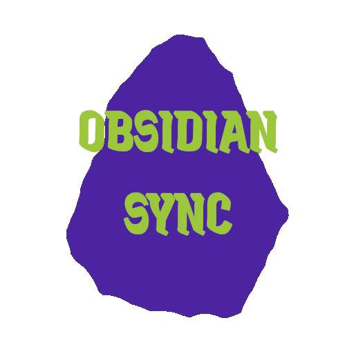

***<p align=center></p>***

<h1 align=center><svg xmlns="http://www.w3.org/2000/svg" height="24px" viewBox="0 -960 960 960" width="24px" fill="#4d24a0"><path d="M160-160v-80h110l-16-14q-52-46-73-105t-21-119q0-111 66.5-197.5T400-790v84q-72 26-116 88.5T240-478q0 45 17 87.5t53 78.5l10 10v-98h80v240H160Zm400-10v-84q72-26 116-88.5T720-482q0-45-17-87.5T650-648l-10-10v98h-80v-240h240v80H690l16 14q49 49 71.5 106.5T800-482q0 111-66.5 197.5T560-170Z"/></svg> Obsidian Synchronizer <svg xmlns="http://www.w3.org/2000/svg" height="24px" viewBox="0 -960 960 960" width="24px" fill="#4d24a0"><path d="M160-160v-80h110l-16-14q-52-46-73-105t-21-119q0-111 66.5-197.5T400-790v84q-72 26-116 88.5T240-478q0 45 17 87.5t53 78.5l10 10v-98h80v240H160Zm400-10v-84q72-26 116-88.5T720-482q0-45-17-87.5T650-648l-10-10v98h-80v-240h240v80H690l16 14q49 49 71.5 106.5T800-482q0 111-66.5 197.5T560-170Z"/></svg></h1>

***<p align=center>is a **FREE** and open-source solution that makes synchronizing your Obsidian vault (& vaults in the future!) simple and hassle-free. With this tool, you can effortlessly use Git (GitHub, GitLab, or other providers) to keep your vaults synced across multiple devices.</p>***

## Core Features:
- **Completely 💸FREE💸**: Enjoy your vault's synchronization without any cost.
- **Seamless Multi-Device Sync**: Synchronize your Obsidian vaults across multiple devices for a consistent & smooth experience anywhere.
- **Total Control Over Your Data**: Your vault stays under **YOUR** control. By leveraging Git, you choose where your data is stored and who can access it.
- **Open Source**: Built with transparency and collaboration in mind, the entire project is open for contributions and improvements.

## How It Works?
The script operates by monitoring the status of the Obsidian app and managing your vault's synchronization in real-time:

1. **Detecting Obsidian Activity**: The script periodically checks whether the Obsidian app is running.
2. **Pulling Updates**: When you open Obsidian, the script ensures your local vault is up-to-date by pulling the latest changes from your Git repository.
3. **Real-Time Synchronization**: As you make changes to any files within your vault, the script automatically commits and pushes those changes to the Git repository. This ensures your updates are available for seamless access on other devices.

With this workflow, your Obsidian vault remains synchronized effortlessly, allowing you to pick up right where you left off on any device.
## Installation:
1. Install **Python** (https://www.python.org/downloads/) and **Git** (https://git-scm.com/downloads)
2. Create Git repo for your vault (on Github, Github etc.)
3. In your vault's location init your repo:

```bash
git init
git remote add origin link-to-your-repo # e.g. https://github.com/SpeedfireV/test.git
git branch -M main
git add .
git commit -m 'init'
git push --set-upstream origin main
```

4. Clone this repo to your local machine `git clone https://github.com/SpeedfireV/obsidian_synchronizer.git`
5. Navigate to the cloned repository's location and install the required dependencies: `pip install -r requirements.txt`
6. Open _repo_info.env_ and change data accordingly with instruction inside the file
## Run the Synchronizer:
Run the script using the following command:
```bash
py main.py
```
**🥳 Congratulations! Your synchronizer is now running successfully! 🥳** But...

You can also automate synchronizer to run each time you run the device you work on - see instructions below.

## Automate Synchronizer to Run on Device Startup
For Windows:
1. Open **Task Scheduler** (`Win + R`, type `taskschd.msc`, and press Enter).
2. Click **Create Basic Task** in the right panel.
3. Follow the wizard:
- **Name**: Enter a name for the task (e.g., Run My Script).
- **Trigger**: Select When I log on.
- **Action**: Select Start a Program.
- **Program**: Enter the path to your Python executable (e.g., `C:\Python310\pythonw.exe` OR your **venv**'s Python executable `C:\...\obsidian_repo_synchronizer\.venv\Scripts\pythonw.exe`!).
- **Add arguments**: Enter the path to your script, e.g., `C:\...\obsidian_repo_synchronizer\main.py`.
- **Run inside**: Enter the path to your script location, e.g., `C:\...\obsidian_repo_synchronizer\`.
4. Click **Finish**.
5. **DONE!** You can already work in Obsidian with synchronization!


## Future Plans:
- Add possibility to run code as a service
- Add instructions for MacOS & Linux synchronization
- Enable support for synchronizing multiple vaults.
- Simplify installation process

<iframe style="width:100%;height:auto;min-width:600px;min-height:400px;" src="https://star-history.com/embed?secret=Z2hwXzd5djF2d2g3Y1VYdFB2amk1ZGRKWnJiTE1JaTNTajBiV3BtZg==#SpeedfireV/obsidian_synchronizer&Date" frameBorder="0"></iframe>